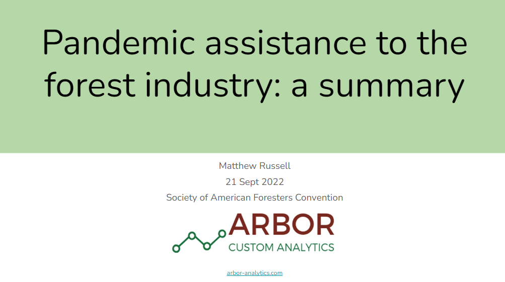

##
 
Forest products and timber harvesting and hauling businesses secured nearly $5 billion of federal funds through the Paycheck Protection Program and Pandemic Assistance to Timber Harvesters and Haulers programs to combat economic challenges presented by the COVID-19 pandemic. These slides were presented at the 2022 Society of American Foresters Convention in Baltimore, MD.

[READ THE SLIDES](https://docs.google.com/presentation/d/1ICpl4hScGt53jDLA6af9eqR0TdprKZFHQvkAXaXEcSw/edit?usp=sharing). 