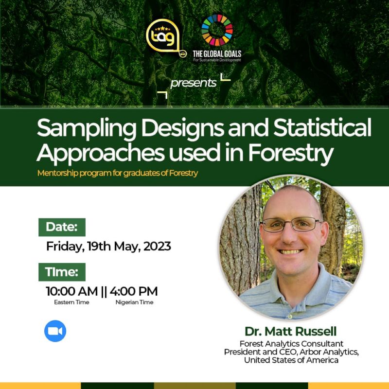

##
 
This workshop for Tag Ng showcased how sampling and statistics can be used in forestry applications. The two-hour virtual workshop discussed common sampling design used in forestry and statistical approaches with forest inventory data. Example coding sessions used the **forestsamplr** and **tidymodels** packages in R. 

* [VIEW SLIDES](https://docs.google.com/presentation/d/12FlhFFPKFmRrEQVdkZQU3bY4aK_hgvsWv5nOa0TY_rM/edit?usp=sharing)
* [VIEW R CODE AND DATA](https://github.com/mbrussell/tagng_sampling_statistics)

